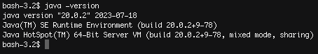
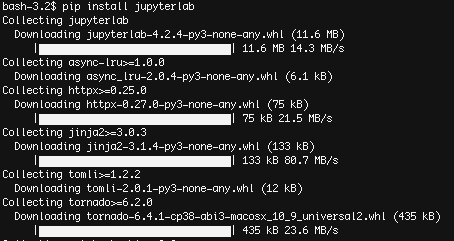
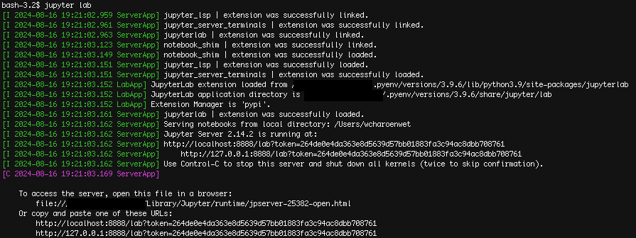
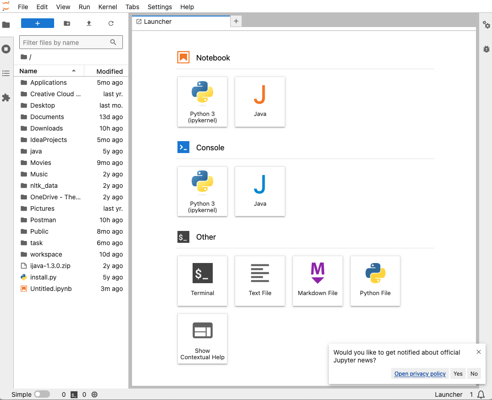
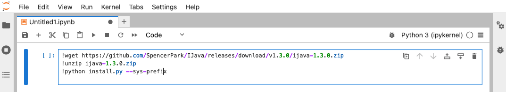
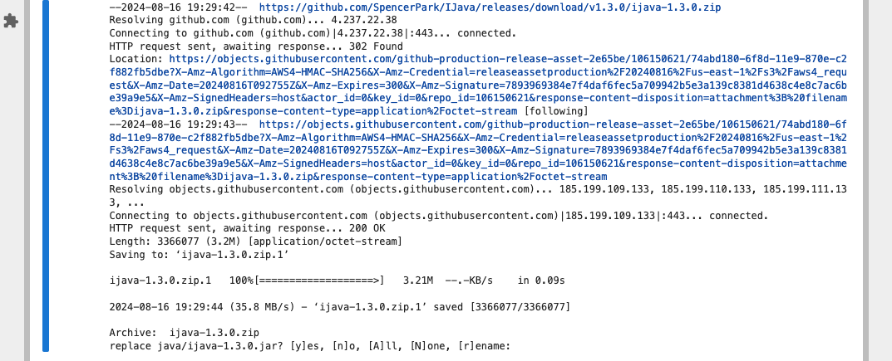
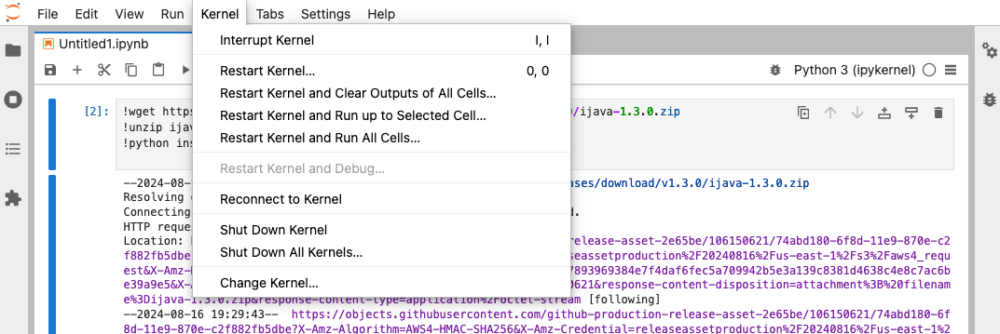
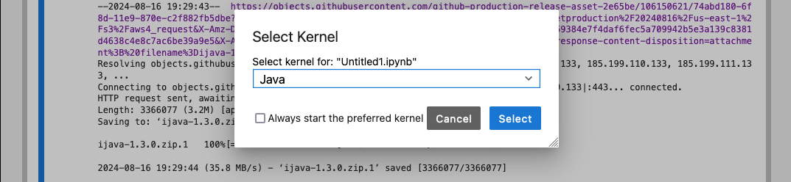
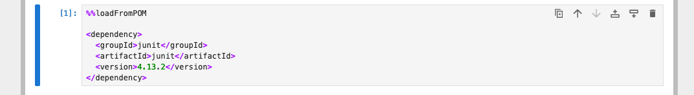

# Step-by-Step Instructions for Installing Jupyter Lab and Java Environment

This document provides the step-by-step instructions for installing Jupyter Lab and activating the Java runtime environment in your personal computer. It aims to cover web-based version of the Jupyter lab. The procedure to integrate Jupyter Lab to VSCode or other IDEs may vary from what is shown in this document.

## Pre-requisites

- **Java Development Kit (JDK)**: Ensure that you have the recent JDK installed on your system. You can check this by running the following commands in your terminal.  

    ```bash
    java -version
    ```

    

    ```bash
    javac -version
    ```

    

    If it's not installed, download and install it from the [Oracle website](https://www.oracle.com/java/technologies/javase-downloads.html) or install it using a package manager of your operating system. For example,

    **for Ubuntu**
    ```bash
    sudo apt install default-jdk
    ```
    **for macOS**
    ```bash
    brew install openjdk
    ```

- **Python**: Jupyter Lab requires Python. You can install Python from the [official Python website](https://www.python.org/downloads/) if it's not already installed. Verify your installation with following command.  

    ```bash
    python --version
    ```

    

- **pip**: Ensure that PIP is installed to manage Python packages. This typically comes with Python, but you can check it by running the following command.  

    ```bash
    pip --version
    ```

    If it's not installed, you can follow the installation methods on [PIP official website](https://pip.pypa.io/en/stable/installation/).  

## Installation Steps

### Install Jupyter Lab using PIP

Run the following command in terminal to install Jupyter Lab. PIP will download and install required packages.

```bash
pip install jupyterlab
```



Verify whether the installation is complete by running following command.

```bash
jupyter lab --version
```


### Start Jupyter Lab (Python Kernel)

To start Jupyter Lab with Python Kernel, run the following command. Jupyter Lab will open a web browser as shown below.  

```bash
jupyter lab
```




To shutdown Jupyter Lab, press CTRL + C and follow the prompt in terminal.

### Install Java Kernel

Click Python 3 (ipykernel) to create a new python notebook. Enter following commands in the cell and execute the cell to download and install Java kernel. This step needs to be executed only once.

```python
!wget https://github.com/SpencerPark/IJava/releases/download/v1.3.0/ijava-1.3.0.zip
!unzip ijava-1.3.0.zip
!python install.py --sys-prefix 
```



Check the status message to ensure that there is no error. The following message indicate that the Java kernel is downloaded twice. Delete the file ijava-1.3.0.zip, install.py, and folder java before running the commands again.  



### Switch to Java Kernel

Click Kernel > Change Kernel… to switch to Java kernel. Choose Java, then click Select.

|  |
| --- |
 |

To test the Java Kernel, create a black cell and enter following command, then execute the cell. There should be no error message.

```java
%%loadFromPOM
<dependency>
<groupId>junit</groupId>
<artifactId>junit</artifactId>
<version>4.13.2</version>
</dependency>
```



Switch to Java Kernel before running the cell that contains Java code.

## Troubleshooting (To-Be Updated)

### Make sure you installed JDK not JRE  
You might encounter issues when trying to run Java programs in Jupyter Lab if you have the Java Runtime Environment (JRE) installed instead of the Java Development Kit (JDK). The JDK is required because it includes development tools like Java compiler (javac) and other utilities necessary for compiling and running Java code. The JRE only includes the environment to run compiled Java programs, not to compile them.

### Make sure `wget` is installed
Java Kernel installation commands use `wget` program to download installation script. `wget` can be installed in various ways depending on your operating system and your development environment. For example, [Windows](https://gnuwin32.sourceforge.net/packages/wget.htm), MacOs [Brew](https://www.google.com/url?sa=t&source=web&rct=j&opi=89978449&url=https://formulae.brew.sh/formula/wget&ved=2ahUKEwjn-JabqoKIAxWJ7DQHHZxIJ7sQFnoECDQQAQ&usg=AOvVaw0mNCn5nDSttqQtJKk7gSM3), [Linux](https://www.cyberciti.biz/faq/how-to-install-wget-togetrid-of-error-bash-wget-command-not-found/), [Pip](https://www.google.com/url?sa=t&source=web&rct=j&opi=89978449&url=https://pypi.org/project/wget/&ved=2ahUKEwjn-JabqoKIAxWJ7DQHHZxIJ7sQFnoECDUQAQ&usg=AOvVaw3w09u9SK03DCwmMzlhNDkI). Also, make sure that it can be run from command line.